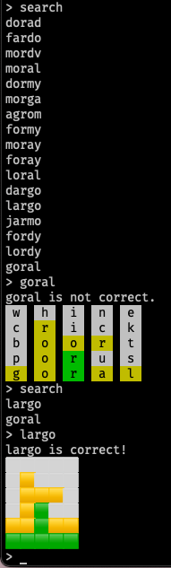

Terminal based [Wordle](https://www.powerlanguage.co.uk/wordle/) clone.

* Contains search functionality to narrow down possibilities.
* Lets you guess as many times as you want to.

Technical details

* Written in Go
* Dependencies: 
  * golang.org/x/term for terminal based functionality.
  * github.com/google/shlex for splitting user input from the terminal.
  * github.com/fatih/color for adding color to terminal output.

